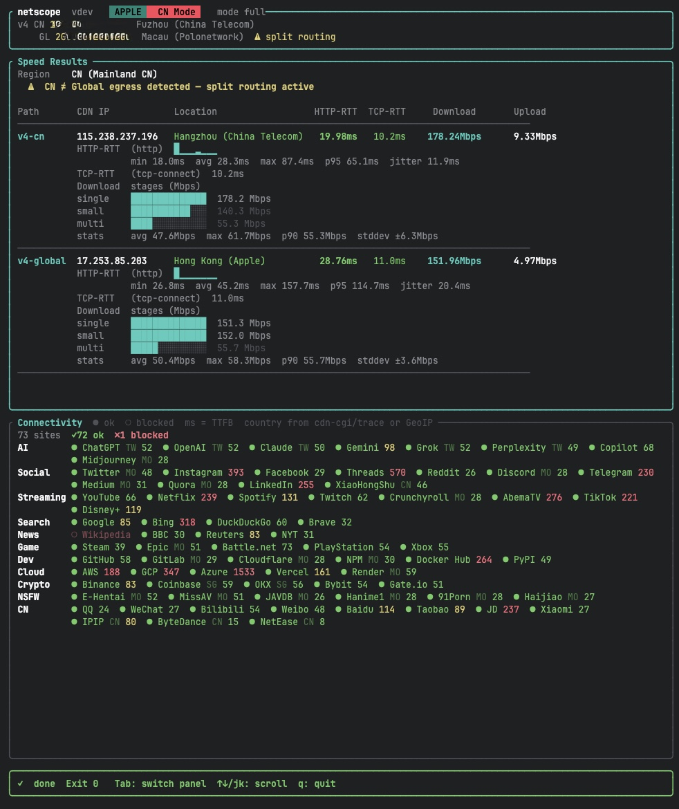

# netscope

> CDN speed test & connectivity probe — Apple / Cloudflare backends, interactive TUI, multi-path & split-routing detection.

[](https://github.com/xjoker/netscope/releases)
[](LICENSE)

[中文说明](README.zh-CN.md)



---

## Features

- **Interactive TUI** — real-time progress, latency sparklines, download stage bar charts
- **Dual backend** — Apple CDN (`mensura.cdn-apple.com`) optimised for China routing; Cloudflare (`speed.cloudflare.com`) for global
- **Multi-path testing** — concurrently tests v4-CN / v4-Global / v6-CN / v6-Global paths and detects split routing
- **Connectivity probe** — checks 70+ sites across 11 categories (AI, Social, Streaming, Search, News, Game, Dev, Cloud, Crypto, NSFW, CN) with TTFB and country-code display
- **Egress detection** — resolves your public IPv4 & IPv6 with geolocation; warns on CN ≠ Global mismatch
- **JSON output** — machine-readable results with stable schema (`schema_version: 1`), `--verbose` flag for full per-path details
- **Proxy support** — `http` / `https` / `socks5` / `socks5h`
- **Single static binary** — zero runtime dependencies

---

## Installation

### Quick run

**Linux x86_64**
```bash
curl -fsSL https://github.com/xjoker/netscope/releases/latest/download/netscope-linux-x86_64 -o netscope && chmod +x netscope && ./netscope
```

**macOS Apple Silicon (M1/M2/M3)**
```bash
curl -fsSL https://github.com/xjoker/netscope/releases/latest/download/netscope-macos-aarch64 -o netscope && chmod +x netscope && ./netscope
```

**Windows PowerShell**
```powershell
irm https://github.com/xjoker/netscope/releases/latest/download/netscope-windows-x86_64.exe -OutFile netscope.exe; .\netscope.exe
```

### Install to system

```bash
# macOS / Linux — replace <BINARY> with the name from the table below
curl -fsSL https://github.com/xjoker/netscope/releases/latest/download/<BINARY> -o netscope && chmod +x netscope && sudo mv netscope /usr/local/bin/
```

| Platform | Binary name |
|----------|-------------|
| macOS Apple Silicon | `netscope-macos-aarch64` |
| macOS Intel | `netscope-macos-x86_64` |
| Linux x86_64 | `netscope-linux-x86_64` |
| Linux aarch64 | `netscope-linux-aarch64` |
| Windows x86_64 | `netscope-windows-x86_64.exe` |

### Other options

- Browse all releases: [github.com/xjoker/netscope/releases](https://github.com/xjoker/netscope/releases)
- Build from source: `cargo build --release` (binary at `target/release/netscope`)

---

## Quick Start

```bash
# Full speed test (TUI, Apple backend)
netscope

# Full speed test via Cloudflare
netscope --backend cloudflare

# Force CN routing (ECS hints for Chinese DNS resolvers)
netscope --country CN

# Connectivity probe only
netscope probe

# JSON output (piped / CI) — stdout is pure JSON, no log noise
netscope --json | jq .

# Verbose JSON with full per-path candidate details (requires --json)
netscope --json --verbose | jq .

# Through a proxy
netscope --proxy socks5://127.0.0.1:1080
```

---

## Commands

```
netscope [OPTIONS] [COMMAND]

Commands:
  ping      Measure latency only (HTTP RTT + TCP connect time)
  download  Measure download speed only
  upload    Measure upload speed only
  full      Full test: latency + download + upload + connectivity probe  [default]
  probe     Connectivity probe (no speed test)

Options:
      --backend <BACKEND>    apple | cloudflare  [default: apple]
      --country <CC>         Force routing country code (e.g. CN, HK, SG, US)
      --proxy <URL>          Proxy URL (http/https/socks5/socks5h)
      --timeout <SECS>       Per-request timeout in seconds  [default: 8]
      --json                 Output JSON results to stdout (progress suppressed)
      --verbose              Include per-path candidate details in JSON output (requires --json)
```

### Subcommand options

```
netscope ping     [--count <N>]                         # default: 8 samples
netscope download [--duration <SECS>]                   # default: 20s
netscope upload   [--ul-mib <MiB>] [--ul-repeat <N>]   # default: 16 MiB × 3
netscope full     [--count <N>] [--duration <SECS>] [--ul-mib <MiB>] [--ul-repeat <N>]

netscope probe    [--concurrency <N>]         # default: 6
                  [--probe-timeout <SECS>]     # default: 10
                  [--category <cat,...>]        # ai,social,streaming,...
                  [--site <keyword>]            # filter by name
                  [--skip-geo]                  # skip GeoIP lookup
```

---

## TUI Interface

### Header badges

| Badge | Meaning |
|-------|---------|
| `APPLE` / `CLOUDFLARE` | Active speed-test backend |
| `CN Mode` | Egress IP detected as mainland China — separate CN and Global paths are tested |
| `Global` | Non-CN egress — only Global path is tested |

The header also shows your egress IPs and geolocation. A **⚠ split routing** warning appears when your CN-side IP differs from your Global-side IP, which typically means a proxy or VPN is only active for some traffic.

### Speed Results panel

| Column | Meaning |
|--------|---------|
| Path | `v4-cn` / `v4-global` / `v6-cn` / `v6-global` — IP family + routing side |
| CDN Node | The IP address and location of the CDN node selected for this path |
| HTTP-RTT | Median HTTP round-trip time across ping samples |
| TCP-RTT | TCP connect time (unavailable when using a proxy) |
| Download | Best download speed across all multi-stream stages |
| Upload | Median upload speed |

Sub-rows below each path show latency sparkline, per-stage download bar charts, and statistics.

### Connectivity panel

`●` (filled) = reachable, `○` (open) = blocked/timed out. Numbers are TTFB in milliseconds. Country codes come from `cdn-cgi/trace` or GeoIP fallback.

### Key bindings

| Key | Action |
|-----|--------|
| `q` / `Q` / `Esc` | Quit |
| `Tab` | Switch focus between Speed / Connectivity panels |
| `↑` / `k` | Scroll up in focused panel |
| `↓` / `j` | Scroll down in focused panel |

---

## Connectivity Probe Categories

| Category | Sites |
|----------|-------|
| AI | ChatGPT, OpenAI, Claude, Gemini, Grok, Perplexity, Copilot, Midjourney |
| Social | Twitter, Instagram, Facebook, Threads, Reddit, Discord, Telegram, Medium, Quora, LinkedIn, XiaoHongShu |
| Streaming | YouTube, Netflix, Spotify, Twitch, Crunchyroll, AbemaTV, TikTok, Disney+ |
| Search | Google, Bing, DuckDuckGo, Brave |
| News | Wikipedia, BBC, Reuters, NYT |
| Game | Steam, Epic, Battle.net, PlayStation, Xbox |
| Dev | GitHub, GitLab, Cloudflare, NPM, Docker Hub, PyPI |
| Cloud | AWS, GCP, Azure, Vercel, Render |
| Crypto | Binance, Coinbase, OKX, Bybit, Gate.io |
| NSFW | E-Hentai, MissAV, JAVDB, Hanime1, 91Porn, Haijiao |
| CN | QQ, WeChat, Bilibili, Weibo, Baidu, Taobao, JD, Xiaomi, IPIP, ByteDance, NetEase |

---

## JSON Output

```jsonc
{
  "schema_version": 1,
  "mode": "full",
  "backend": "apple",
  "ts": 1700000000,         // Unix timestamp (seconds)
  "egress_v4_cn": "1.2.3.4",
  "egress_v4_global": "1.2.3.4",
  "egress_consistent": true, // false = split routing detected (CN ≠ Global)
  "resolver_country": "CN",
  "download_mbps": 523.4,
  "upload_mbps": 87.1,
  "rtt_ms": 12.3,
  "paths": [
    {
      "path_id": "v4-cn",
      "cdn_ip": "17.253.x.x",
      "cdn_location": "China/Shanghai (Chinanet)",
      "download_mbps": 651.2,
      "upload_mbps": 91.4,
      "rtt_ms": 8.1
    }
  ]
}
```

`schema_version` is `1` and is **additive-only** — existing fields will never be removed or type-changed in future releases.

---

## Exit Codes

| Code | Meaning |
|------|---------|
| `0` | All tests passed |
| `2` | Fatal error / all paths failed |
| `3` | Partial failure (some paths failed) |
| `130` | Aborted by user (Ctrl-C / `q`) |

---

## FAQ

**macOS: "cannot be opened because the developer cannot be verified"**

This is macOS Gatekeeper blocking unsigned binaries. Run once to clear the quarantine flag:
```bash
xattr -d com.apple.quarantine ./netscope
```
Or: right-click the binary in Finder → Open → Open.

**Windows: garbled characters / boxes in the TUI**

The TUI uses Unicode block characters and Braille patterns. Use [Windows Terminal](https://aka.ms/terminal) with a font that supports these (e.g. Cascadia Code, Nerd Fonts). The built-in CMD and older PowerShell consoles do not render them correctly.

**Many timeouts during `probe`**

This is expected when running from mainland China — most international sites are blocked or heavily throttled. Increase `--probe-timeout` for slow links:
```bash
netscope probe --probe-timeout 15
```

**Speed results differ significantly between Apple and Cloudflare backends**

They measure different things: the Apple backend uses DoH-based IP selection and IP pinning against Apple's CDN, optimised to reflect how Apple services perform from your location. The Cloudflare backend measures throughput to the nearest Cloudflare PoP. Neither is a general-purpose ISP speed test.

---

## License

MIT
